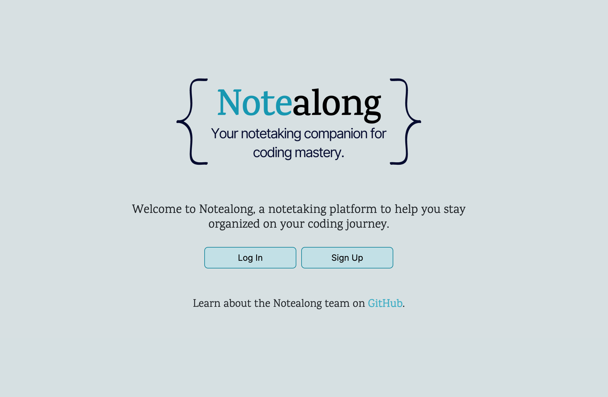
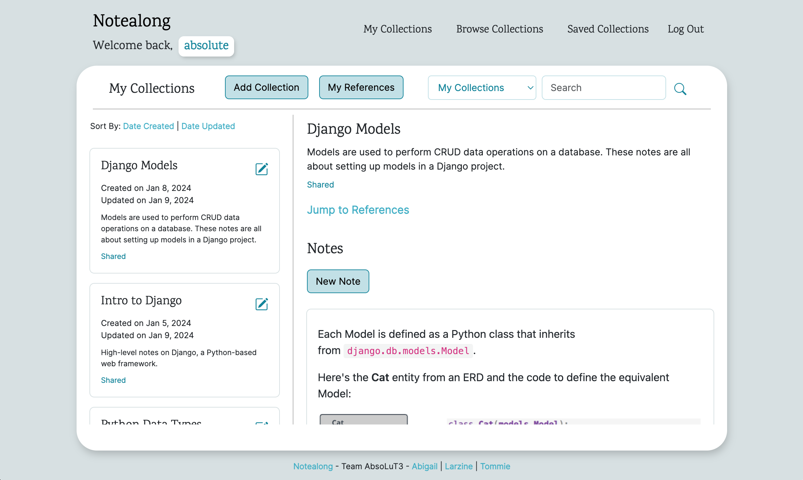
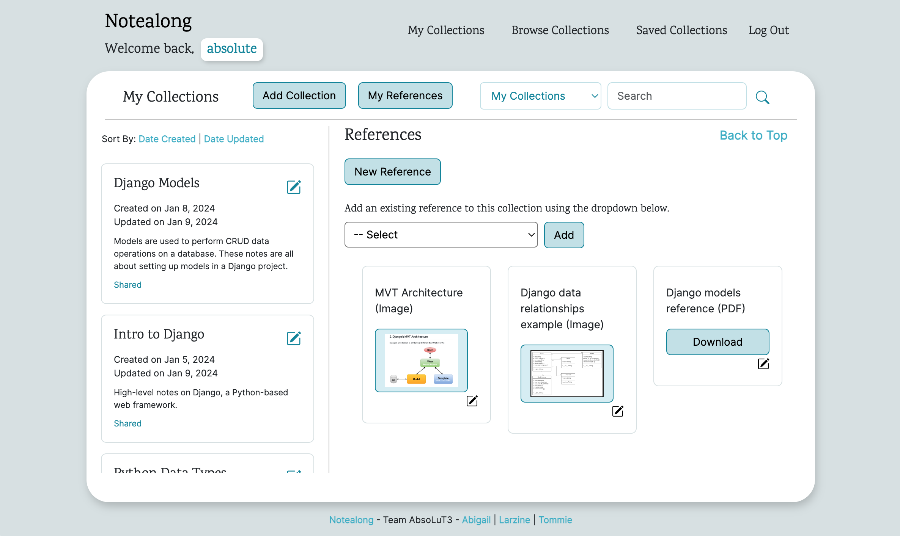
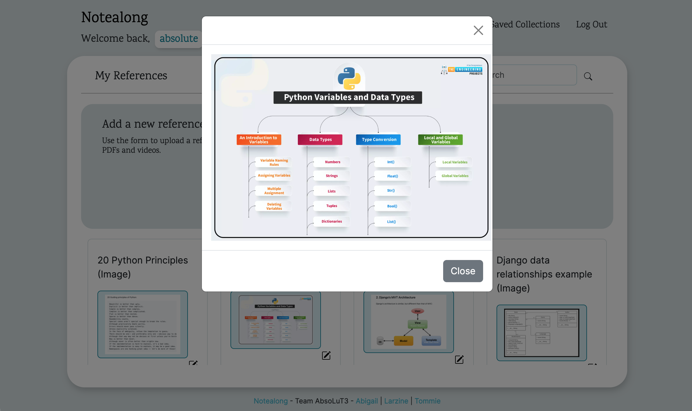

# 
Notealong

## 
[Live Site](https://notealong-fad09aab9558.herokuapp.com/)

## 
Introduction

As software engineering students, our team has a deep appreciation for the importance of good organizational systems. Between online classes, assignments, labs and projects, we found our coding notes ended up scattered across multiple apps and files, making it easy to lose track of important information. We created **Notealong** to provide a platform for people learning to code to keep all of their coding notes in one place.  

With **Notealong**, learners can organize important information into collections of notes and references and easily search through their collections. **Notealong**'s sleek, minimalist UI allows learners to worry less about staying organized and focus on what's important: learning to code.

### 
Building a Learning Community

When our team began brainstorming how to create our dream notetaking app for coders, integrating a community aspect was a no-brainer. Learning to code ourselves has taught us the importance of seeking out new perspectives and learning from how others approach the same problems we encounter ourselves. **Notealong** allows users to share their own collections and browse collections shared by others, creating a community of like-minded coding enthusiasts with a shared goal of collaborative learning.

## 
Using the Notealong App

#### *Logging In | Signing Up*
Users must create an account to access the app's full functionality. **Notealong** uses Django's built-in sign up and login functionality, making signing up as simple as providing a valid username and password.

#### *Creating a Collections*
Users can get started right away by creating their first collection. After inputting a name and description for their collection and choosing if they'd like to share it publicly, users can then proceed to add notes and references to the collection.

* **Collection** - A group of notes and references collected around a particular subject.
* **Note** - Any text-based material provided by the user. Notes can be formatted with headings, a variety of font styles, hyperlinks, embedded images and codeblocks.
* **Reference** - An uploaded file, such as an image, PDF or video. Unlike notes, references do not need to be linked to a particular collection, and the same reference could be linked to many different collections.

#### *Viewing all References*
Users can view all of their references on the **My References** page. Here, users have the option to add, update or delete references, even those that are not associated with a collection.

#### *Browsing and Saving Other Users' Collections*
Users can choose to browse all collections shared by other users or search for a particular keyword using the search bar.

To save a collection for easy access later, users can click the Save button on any collection that another user has shared.

## 
Tech

### 
HTML & CSS | Python & Django | PostgreSQL | Bootstrap 5

TinyMCE plugin for text editor with code blocks

## 
Next Steps

There are a number of additional features currently in development:

1. **Associating notes with more than one collection** - Our project organizes Collections and Notes in a M:M relationship. We would like to add functionality for a user to add the same note to more than one collection and view all notes regardless of whether they are in a collection or not.

2. **Scaling** - Notealong functions great with a small user base, but as user volume increases we will need to refine features such as search functionality and pagination.